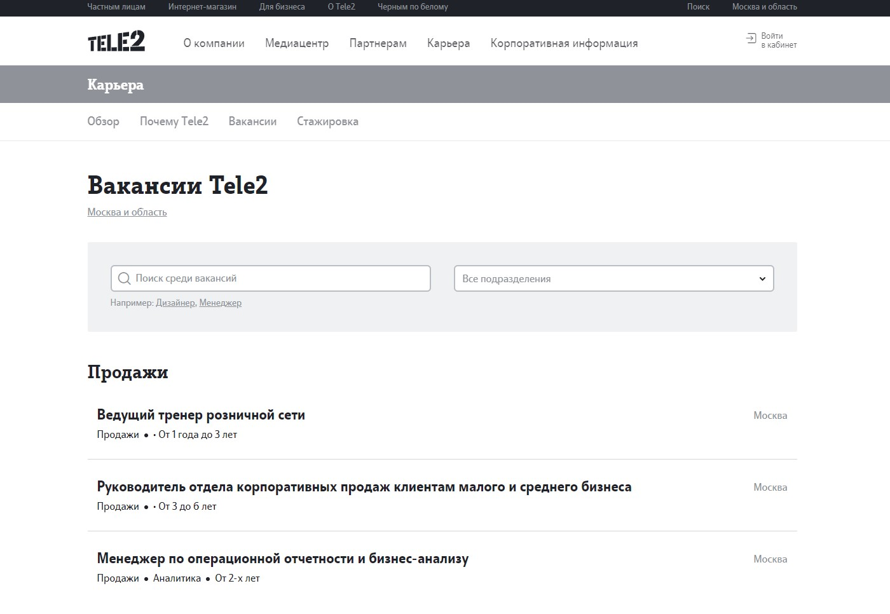
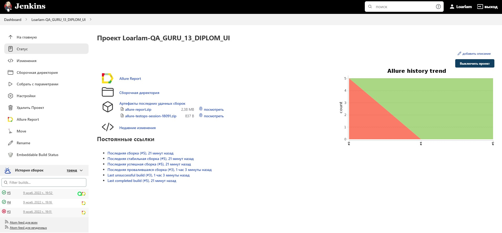
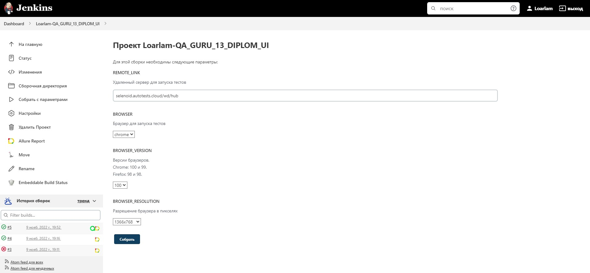
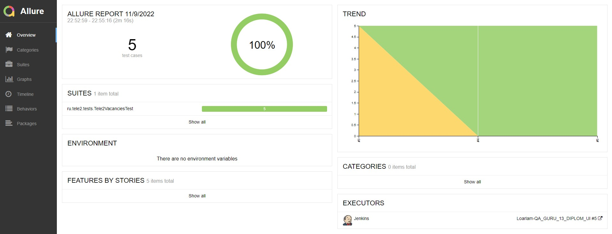
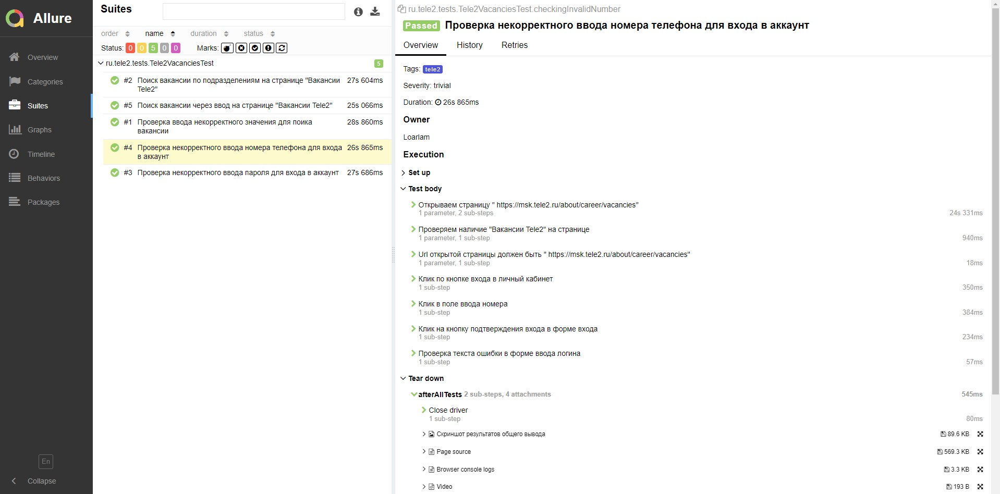
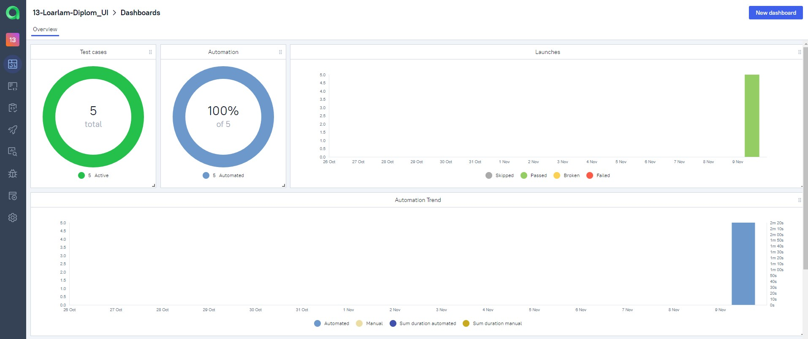
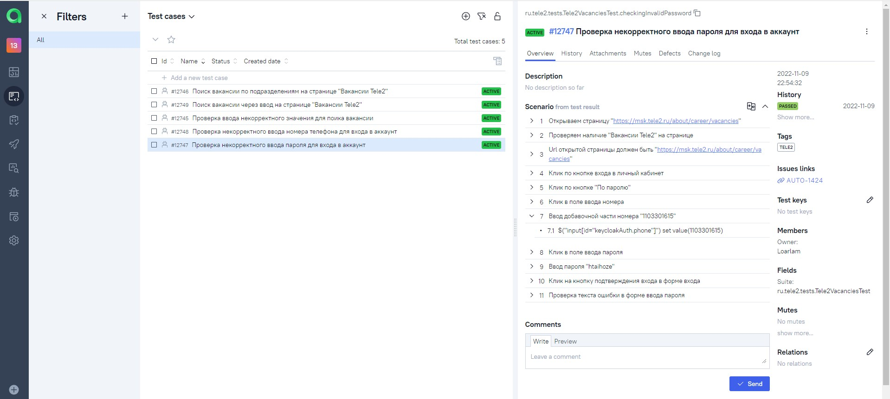
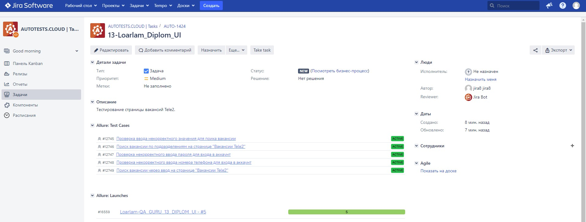
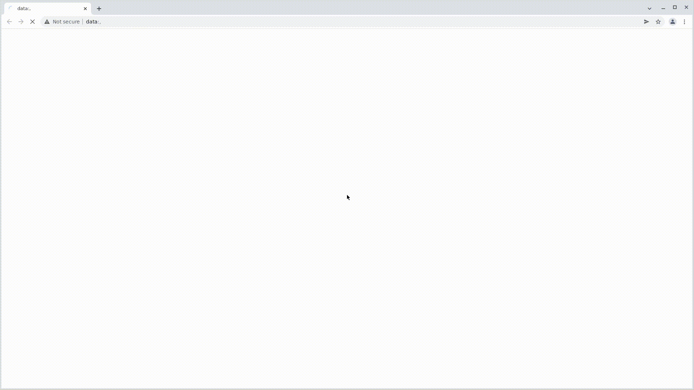
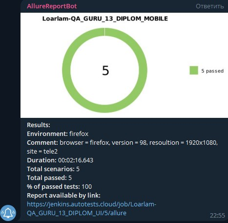

# Автоматизация тестирования страницы вакансий Tele2

<kbd>[](https://msk.tele2.ru/about/career/vacancies)</kbd>

## Содержание:
+ [Стек технологий](#computer-Стек-технологий)
+ [Тестовые сценарии](#clipboard-Тестовые-сценарии)
+ [Сборка в Jenkins](#-Сборка-в-Jenkins)
+ [Команды запуска тестов в терминале](#desktop_computer-Команды-запуска-тестов-в-терминале)
+ [Интеграция с Allure report](#-Интеграция-с-Allure-report)
+ [Интеграция с Allure TestOps](#-Интеграция-с-Allure-testOps)
+ [Интеграция с Jira](#-Интеграция-с-Jira)
+ [Видео прохождения тестов](#cinema-Видео-прохождения-Тестов)
+ [Информирование в Telegram](#-Информирование-в-Telegram)

## :computer: Стек технологий
<p align="center">
<a href="https://www.java.com/"></a>
<a href="https://github.com/"></a>
<a href="https://www.jetbrains.com/idea/"></a>
<a href="https://gradle.org/"></a>
<a href="https://selenide.org/"></a>
<a href="https://junit.org/junit5/"></a>
<a href="https://aerokube.com/selenoid/"></a>
<a href="https://www.jenkins.io/"></a>
<a href="https://github.com/allure-framework/allure2"></a>
<a href="https://qameta.io/"></a>
<a href="https://www.atlassian.com/software/jira"></a>
<a href="https://telegram.org/"></a>
</p>

## :clipboard: Тестовые сценарии
+ :white_check_mark: Поиск вакансии через ввод на странице "Вакансии Tele2"
+ :white_check_mark: Поиск вакансии по подразделениям на странице "Вакансии Tele2"
+ :white_check_mark: Проверка ввода некорректного значения для поика вакансии
+ :white_check_mark: Проверка некорректного ввода номера телефона для входа в аккаунт
+ :white_check_mark: Проверка некорректного ввода пароля для входа в аккаунт

##  Сборка в Jenkins
<kbd>[](https://jenkins.autotests.cloud/job/Loarlam-QA_GURU_13_DIPLOM_UI)</kbd>

#### Параметры сборки:
| Параметры          | Значение                            |
|:-------------------|:------------------------------------|
| REMOTE_LINK        | Удаленный сервер для запуска тестов |
| BROWSER            | Браузер для запуска тестов          |
| BROWSER_VERSION    | Версия браузера                     |
| BROWSER_RESOLUTION | Размер окна браузера                |

<kbd>[](https://jenkins.autotests.cloud/job/Loarlam-QA_GURU_13_DIPLOM_UI/build)</kbd>

## :desktop_computer: Команды запуска тестов в терминале
#### Команды для локального запуска:
```bash
./gradlew clean taskWithTagVacancy -Dhost=localLaunch
```

#### Команды для удаленного запуска:
```bash
clean
taskWithTagVacancy
-DremoteLink=${REMOTE_LINK}
-Dbrowser=${BROWSER}
-Dversion=${BROWSER_VERSION}
-Dresolution=${BROWSER_RESOLUTION}
-Dhost=remoteLaunch
```

##  Интеграция с Allure report
#### Диаграммы прохождения тестов:
<kbd>[](https://jenkins.autotests.cloud/job/Loarlam-QA_GURU_13_DIPLOM_UI/allure/)</kbd>

#### Развернутый результат прохождения тестов:
| Левая часть скриншота | Правая часть скриншота            |
|:----------------------|:----------------------------------|
| Тестовые сценарии     | Подробное описание шагов          |
|                       | Финальный скриншот каждого теста  |
|                       | Исходники страницы теста          |
|                       | Исходники консоли браузера        |
|                       | Финальный ролик с процессом теста |

<kbd>[](https://jenkins.autotests.cloud/job/Loarlam-QA_GURU_13_DIPLOM_UI/allure/#suites/dd42ccbcb85ab2254f42f38d37f17b1d)</kbd>

##  Интеграция с Allure TestOps
#### Диаграммы прохождения тестов:
<kbd></kbd>

#### Развернутый результат прохождения тестов:
| Левая часть скриншота | Правая часть скриншота            |
|:----------------------|:----------------------------------|
| Тестовые сценарии     | Подробное описание шагов          |
|                       | Финальный скриншот каждого теста  |
|                       | Исходники страницы теста          |
|                       | Исходники консоли браузера        |
|                       | Финальный ролик с процессом теста |

<kbd></kbd>

##  Интеграция с Jira
<kbd></kbd>

## :cinema: Видео прохождения тестов
#### :white_check_mark: Проверка ввода некорректного значения для поика вакансии:
<p align="center">
  
</p>

#### :white_check_mark: Поиск вакансии по подразделениям на странице "Вакансии Tele2":
<p align="center">
  
</p>

#### :white_check_mark: Проверка некорректного ввода пароля для входа в аккаунт:
<p align="center">
  
</p>

#### :white_check_mark: Проверка некорректного ввода номера телефона для входа в аккаунт:
<p align="center">
  
</p>

#### :white_check_mark: Поиск вакансии через ввод на странице "Вакансии Tele2":
<p align="center">
  
</p>

##  Информирование в Telegram
#### Оповещение ведется при помощи Telegram bot API:
<kbd></kbd>